# 含自动回复机器人的心理咨询服务网站

随着社会的进步，生活节奏的加快，竞争的日益激烈，人们承受的心理压力越来越大，特别是当代大学生们，在高等教育逐渐大众化阶段的今天，大学校园已不再是美好的“象牙塔”，因此，大学生们在校期间常常面临着各方面的心理冲突与心理困惑。

而面对这一基本的心理咨询需求，目前校园内仍缺乏一个方便快捷的在线平台，为这一类大学生提供一个与心理咨询师交流和接触的渠道。

## 基础功能

- 提供基础的内容服务，如：心理知识科普、培训内容的通知、心理咨询师的个人资料等
- 提供与培训师一对一交流及辅导前联系沟通的渠道，包括：站内信、留言板等
- 提供自动问答机器人，对用户的提问进行简单的识别并在相关题库中搜寻、给出回答
- 提供用户的注册和登陆功能，包含个人资料的修改、密码的修改等
- 记录用户的来访信息，包含：来访时刻、咨询时间、咨询次数、咨询对象、主诉问题等
- 保护用户隐私，可设置相关的Privacy权限
- 友好的人机交互，如输入合法性检测、无提交验证码校验、Cookie登陆等
- XSS攻击过滤、SQL注入攻击防御

## 界面预览

> - 通过[视频查看](.github/video)使用效果。
> - 查看[样式模板](.github/app_preview/demo)。

1. 登录/注册界面

<p aligh="center">
    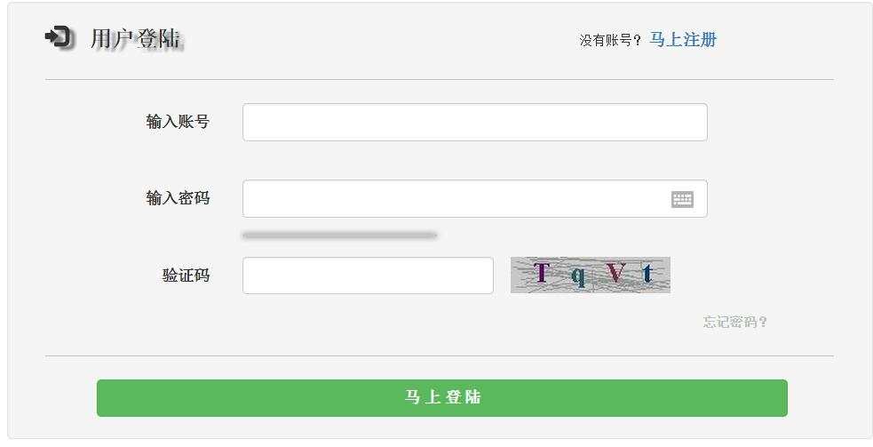
</p>

<p aligh="center">
    
</p>

<p aligh="center">
    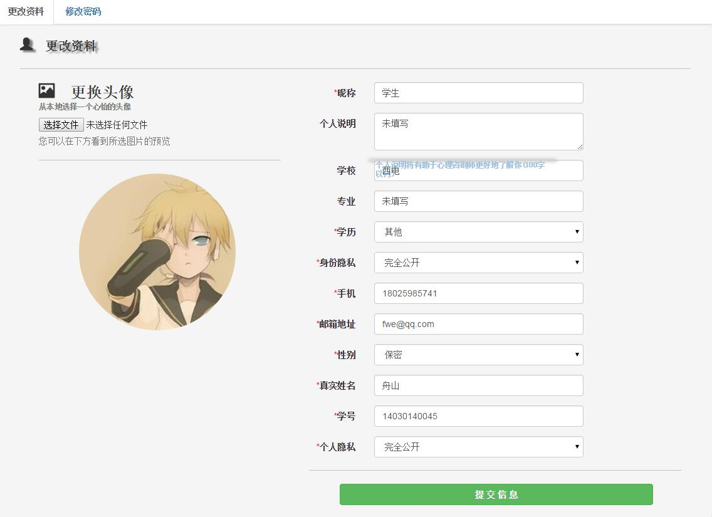
</p>

2. 主页/导航页

<p aligh="center">
    
</p>

3. 心理咨询师资料页/列表

   <p  aligh="center">
       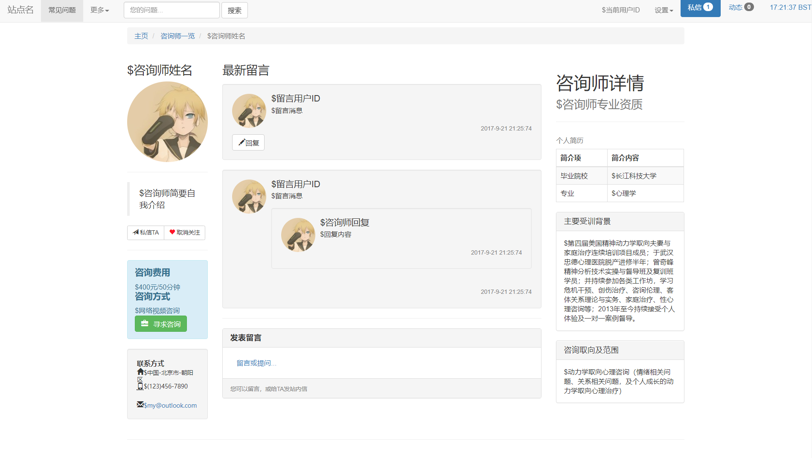
   </p>

<p aligh="center">
    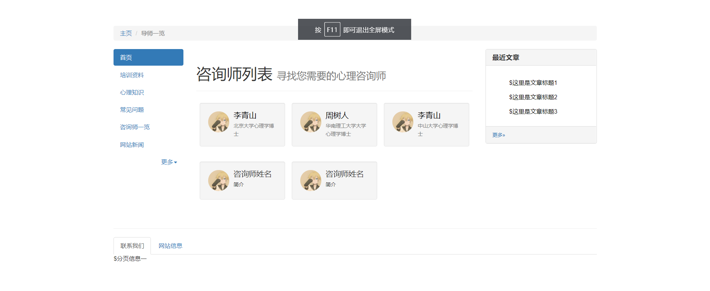
</p>

4. 私信框

<p aligh="center">
    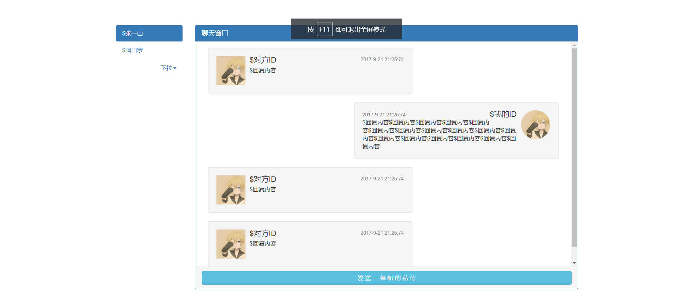
</p>

## 架构

1. AJAX

<p aligh="center">
    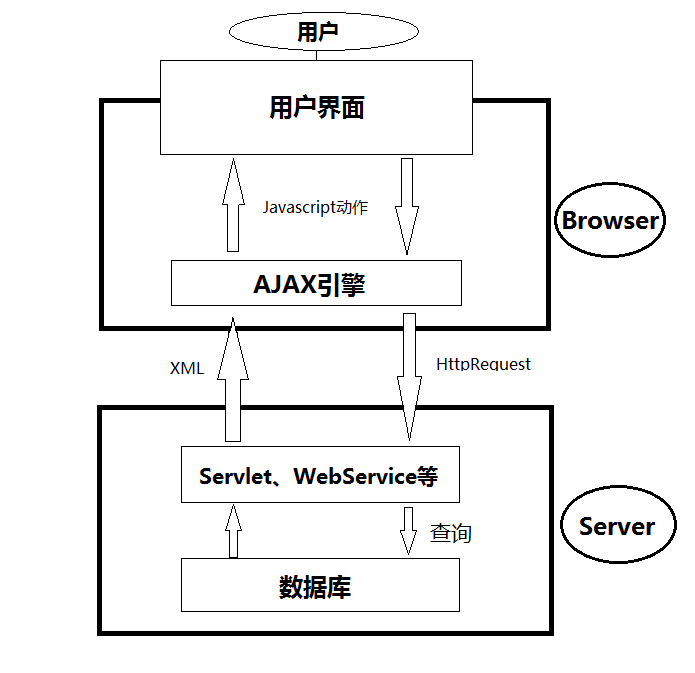
</p>

2. JSP工作流程

<p aligh="center">
    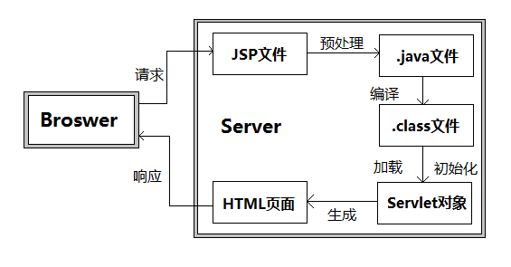
</p>

3. DAL层设计

<p aligh="center">
    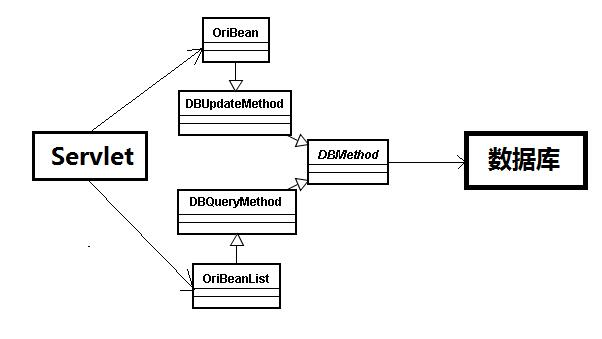
</p>

4. JSP MVC架构

<p aligh="center">
    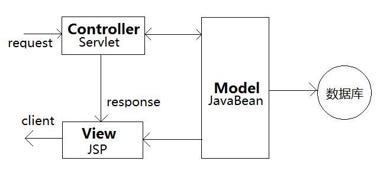
</p>

5. 数据库接入对象

<p aligh="center">
    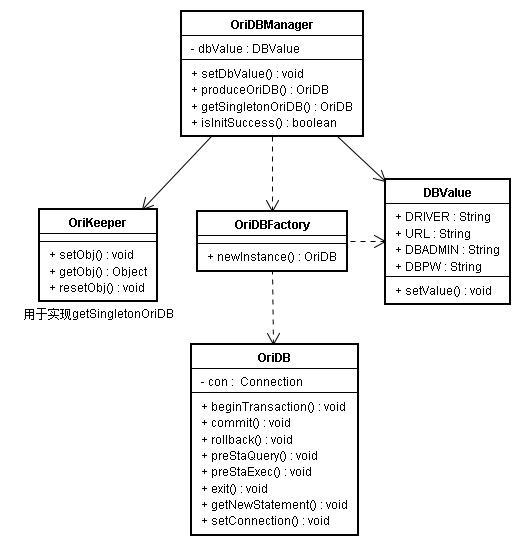
</p>

6. 数据持久层对象

<p aligh="center">
    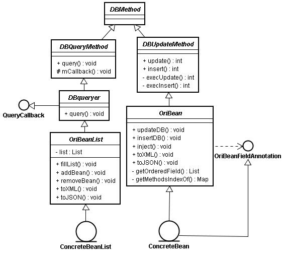
</p>

7. 数据模型层对象

<p aligh="center">
    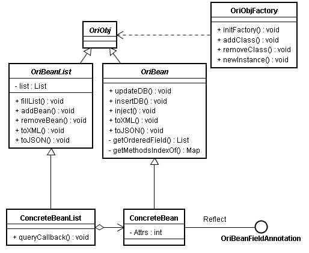
</p>

8. 数据流图

<p aligh="center">
    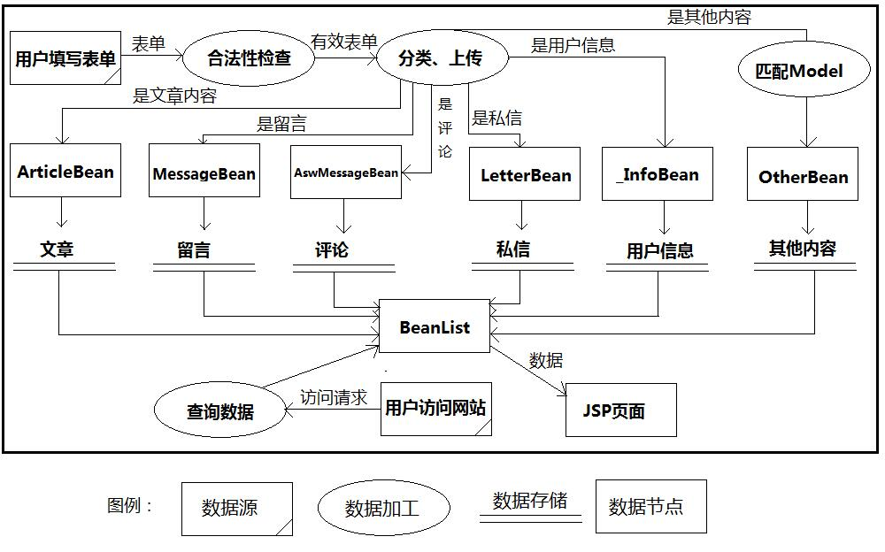
</p>

9. E-R图

<p aligh="center">    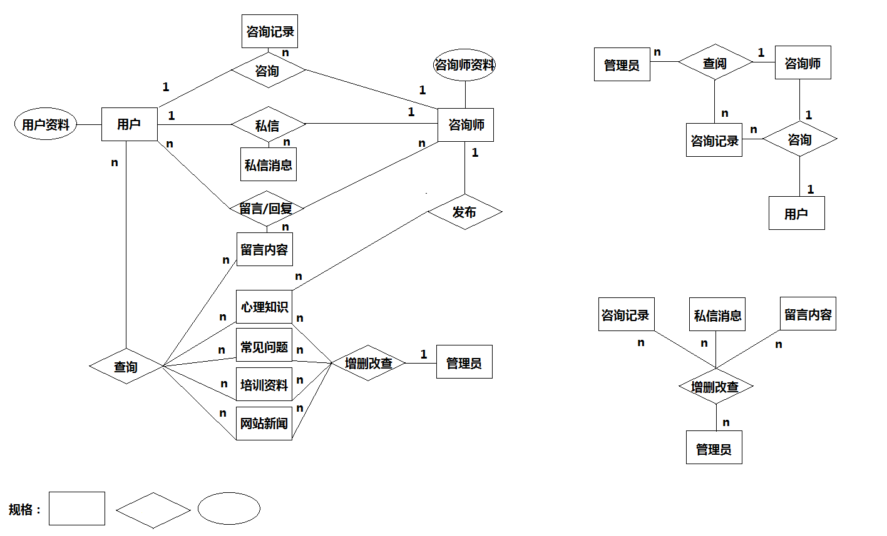</p>
## 算法设计

**1. 反射机制**

利用JAVA的反射机制，对Model进行进一步的抽象，并提供更便捷的数据库访问方法，减少了SQL语句在Java代码中的掺杂程度，使得代码便于维护和书写。

```java
@BeanFieldAnnotation(order = 5,colName = "texts") 
private String texts ;
```

其核心主要有两点：

一个属性注解BeanFieldAnnotation，其包含三个值keyType、colName、order，分别标注了该值在数据库中的键值类型、列名以及列顺序。


其标注了OriBean中的一个属性名为texts的值，对应着数据库中某个表中 列名为texts的列，同时该值对应这个数据体顺序为order为5的位置。

标注order是由于，JVM有权对代码中变量的声明顺序进行优化，这会对Rejcet时返回的Field[]顺序造成影响进而影响对OriBean的inject操作。标注order将保证放射时按顺序返回相应的Field[]，并按顺序对该Model（即OriBean）进行值的注入。

这是一种控制反转（IOC），将Model层和Controller层剥离开来，Controller层负责根据数据类型调用相应的数据模型，并将数据注入（inject）数据模型（Model），由数据模型完成与数据库的对接。这样，控制层不直接依赖于Model层，而模型层的ConcreteModel只在需要时被Controller利用反射机制调用，对数据的控制由Controller将进行反转（转交给Model层）。

**2. 中文分词-正向匹配**

按照设计需求，我们需要完成一个可自动根据用户提问回答问题的系统。本质上这是一个检索系统，我们根据用户输入，通过正则操作和模糊查询对数据库进行检索，并最终返回相应的内容给用户。

其难度就在于如何对用户的输入进行关键词提取，也就是中文分词问题。

在算法设计上，我们对每一个登记在库的预制问答数据进行关键词登记，并将这些关键词登陆到字典中。每次操作通过字典进行正向匹配，提取关键词。由于网站定位时，预期的用户规模和数据集大小并不大，这种轻量化的方法可以保证代码的简洁、并提供足用的运行效率。

同时，我们将在此留出接口，方便后期的扩充。

**3. 数据库账密加密**

数据库中用户的密码采用MD5加密，对数据库撞库提供了一定的防护。